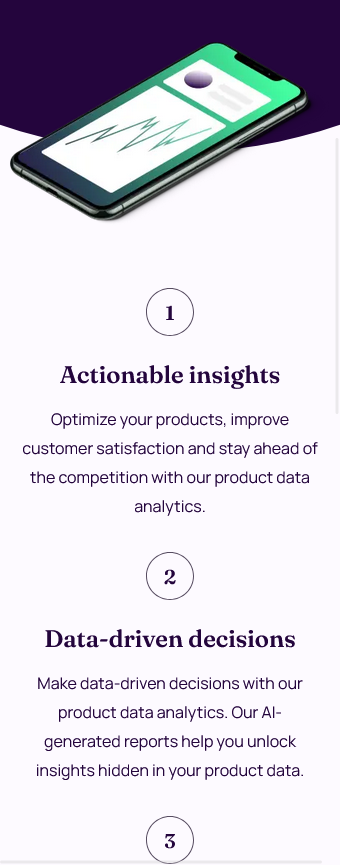
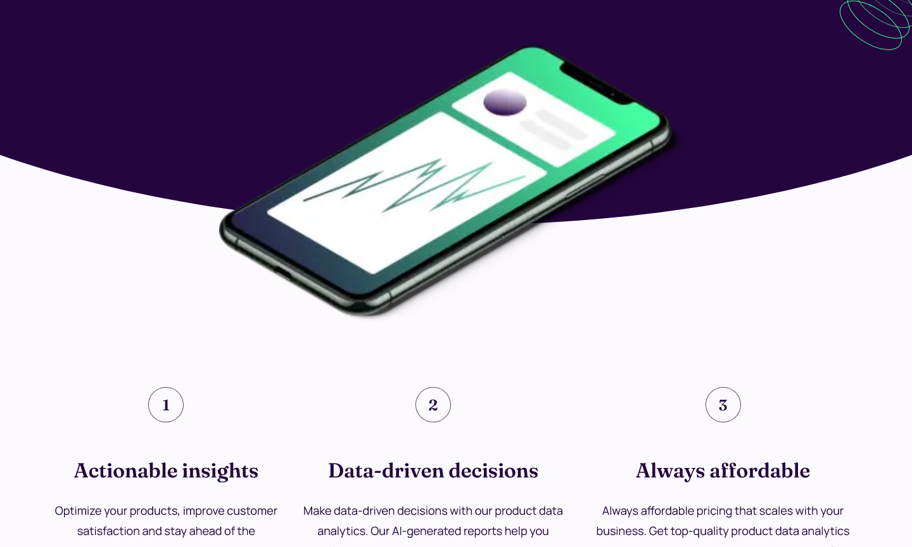

# Workit Landing Page

"Workit" is a landing page designed to promote a data analytics service for businesses,
helping them make informed decisions through AI-generated reports. The page encorages
users to become beta testers and gain early access to the platform for enhanced customer
satisfaction insights.

## Table of contents

- [Overview](#overview)
  - [The challenge](#the-challenge)
  - [Screenshot](#screenshot)
  - [Links](#links)
- [My process](#my-process)
  - [Built with](#built-with)
  - [Installation Steps](#installation-steps)
  - [Useful resources](#useful-resources)
- [Author](#author)

## Overview

### The challenge
The Challenge was to create a visually appealing and functional landing page that clearly
presents the service's benefits while inviting users to join as beta testers. The focus 
was on building an intuitive, mobile-responsive user experience suitable for any device.

### Screenshot

- Phone Device

- Tablet Device

- Desktop Device

_If the images are not visible, please check the file path or ensure the screenshots exists._

### Links

- [Live Site](https://workit-landing-page-zeta.vercel.app/) - View the live version of the FAQs Accordion.

## My process

### Built with

- Mobile-first workflow
- [Sass](https://nextjs.org/docs/app/building-your-application/styling/sass) - Sass for styling
- [React](https://reactjs.org/) - TS library
- [Next.js](https://nextjs.org/) - React framework

### Installation Steps

  #### 1. Clone the repository (if you haven't already)
    git clone git@github.com:nmelissarp/workit-landing-page.git
  #### 2. Navigate to the project folder
    cd workit-landing-page
  #### 3. Install dependencies
    npm install
  #### 4. Run the development server
    npm run dev
  #### 5. Verify the application Open your browser and navigate to http://localhost:3000 to ensure everything is working as expected.

### Useful resources

This resources were essential in resolving the issue where the clip-path layer was overlapping other elements with the same parent.
By understanding how z-index interacts with clip-path, I was able to adjust the stacking order and ensure that the hero layer no
longer covered the background image.
[Understanding z-index](https://ishadeed.com/article/understanding-z-index/?utm_source=chatgpt.com)
[Stack Overflow discussion on clip-path and z-index](https://stackoverflow.com/questions/57327586/why-does-clip-path-and-other-properties-affect-the-stacking-order-z-index-of?utm_source=chatgpt.com)

These resources helped me learn how to modify the color of SVG icons through CSS, enabling me to easily customize the appearance of icons on my landing page:
[Stack Overflow: Manipulating External SVGs with CSS](https://es.stackoverflow.com/questions/299519/c%C3%B3mo-manipular-un-svg-externo-con-css) - Explained how to target external SVG files for styling.
[Stack Overflow: Manipulating External SVGs with CSS](https://www.paradigmadigital.com/dev/color-iconos-svg/) - Explained how to target external SVG files for styling
[Go Make Things: currentColor and SVGs](https://gomakethings.com/currentcolor-and-svgs/) - Showed how to use the currentColor property for dynamic color changes.

## Author

- [Melissa Ramírez](https://www.linkedin.com/in/nmelissarp/) - Developer and enthusiast of web development, always learning and experimenting with new technologies.